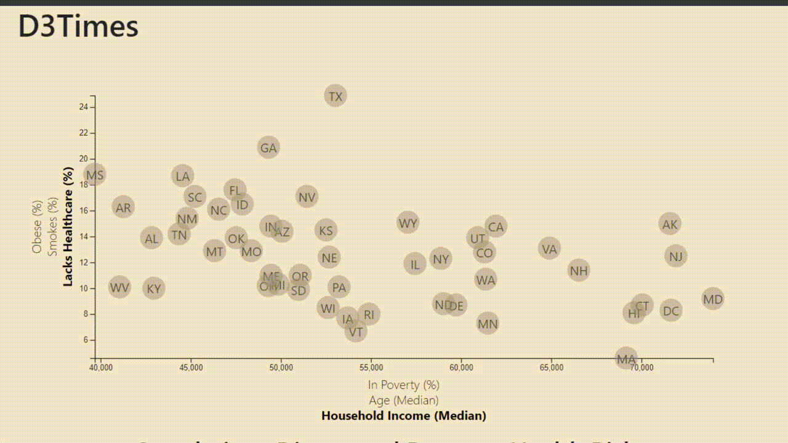

# Custom Visualization with D3
An custom, interactive visual based on 2014 ACS 1-year estimates from the US Census Bureau.
Created using the D3 JavaScript library. 

[D3 documentation](https://d3js.org/)

Currently the webpage is not hosted, so the easiest way to view is to clone the repo and open index.html using the Live Server plugin for Visual Studio Code. 

## Demonstration

